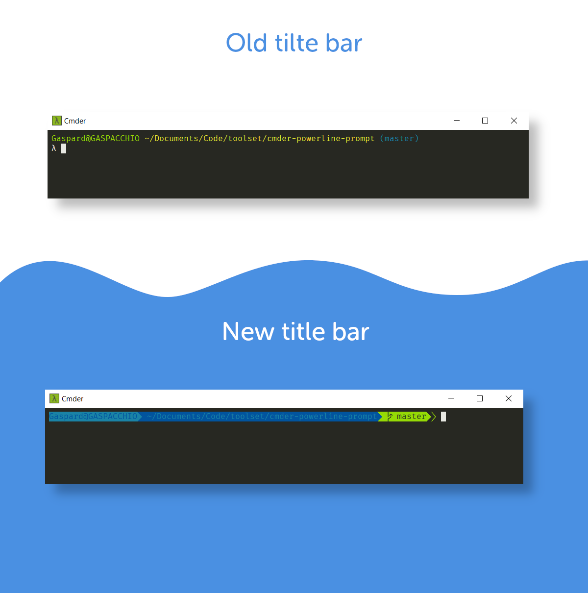
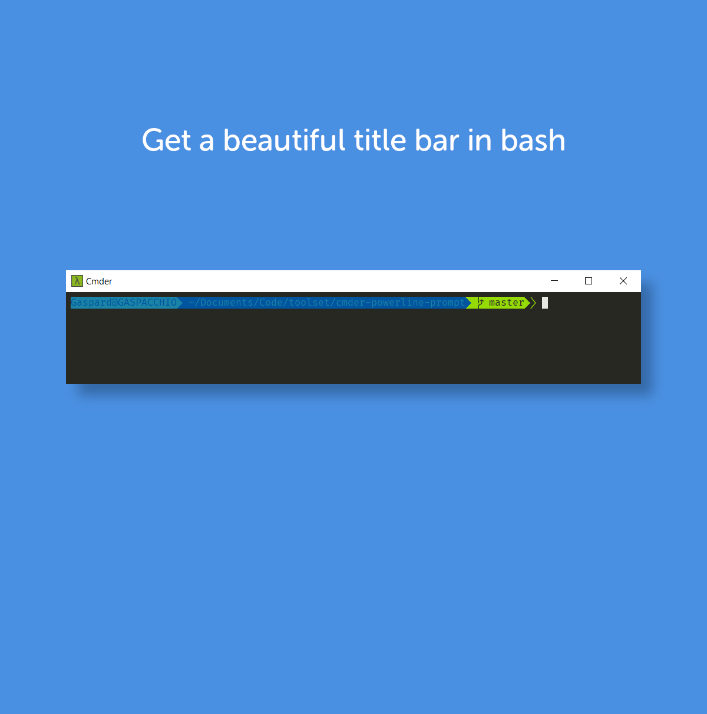

# Powwerline title bar in bash on Windows

*Thanks to [diesire](https://github.com/diesire)'s project: https://github.com/diesire/git_bash_windows_powerline*

Get an improved title bar in bash on windows.




## Setup

Run these commands in your usual bash shell:

```bash
cd $HOME
mkdir -p .bash/themes/git_bash_windows_powerline
git clone https://github.com/diesire/git_bash_windows_powerline.git .bash/themes/git_bash_windows_powerline
````
And then add these lines to your `.bashrc`: 

```bash
# Theme
THEME=$HOME/.bash/themes/git_bash_windows_powerline/theme.bash
if [ -f $THEME ]; then
   . $THEME
fi
unset THEME
````

## Notes

I suggest using the [Fira Code font](https://github.com/tonsky/FiraCode).