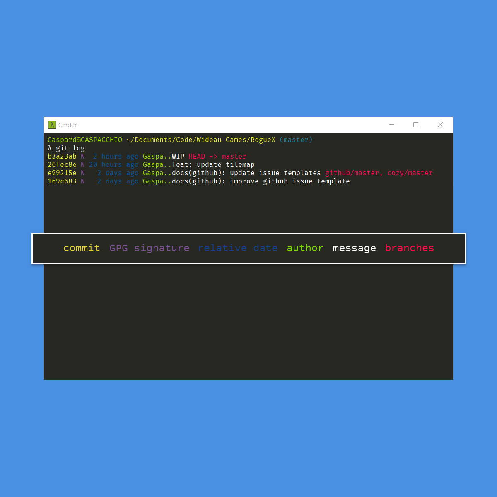

# A better git log

*Thanks to [andsen](https://stackoverflow.com/users/339505/andsens)'s answer: https://stackoverflow.com/a/9463536/8932080*

This `git log` custom configuration shows, on one line, the maximum amount information about the history.



## Setup

In your `.gitconfig`, append the following lines:

````
[log]
    date = relative
[format]
     pretty = format:%C(auto,yellow)%h%C(auto,magenta)% G? %C(auto,blue)%>(12,trunc)%ad %C>
````

or issue the following commands:

```bash
git config --global log.date relative
git config --global format.pretty "format:%C(auto,yellow)%h%C(auto,magenta)% G? %C(auto,blue)%>(12,t runc)%ad %C(auto,green)%<(7,trunc)%aN%C(auto,reset)%s%C(auto,red)% gD% D"
````
That's it, enjoy your new `git log` command!

## Demo

